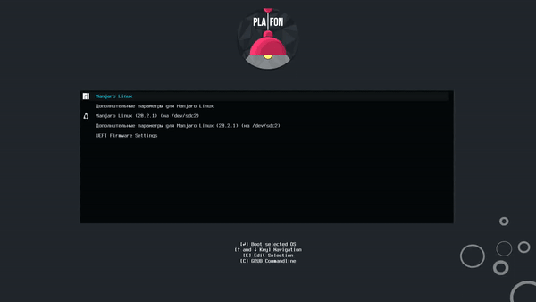

# MANJARO GRUB THEME FROM PLAFONLINUX
 

 
01. git clone https://github.com/plafonlinux/plafon-grub-theme.git
02. Add folder plafon on GRUB Theme`s folder

/usr/share/grub/themes/

03. Edit GRUB Configuration

sudo nano /etc/default/grub

Then replace :

GRUB_THEME="/usr/share/grub/themes/manjaro/theme.txt"

to 

GRUB_THEME="/usr/share/grub/themes/plafon/theme.txt"

Save file

04. Update the new configuration, open the terminal 

sudo update-grub
